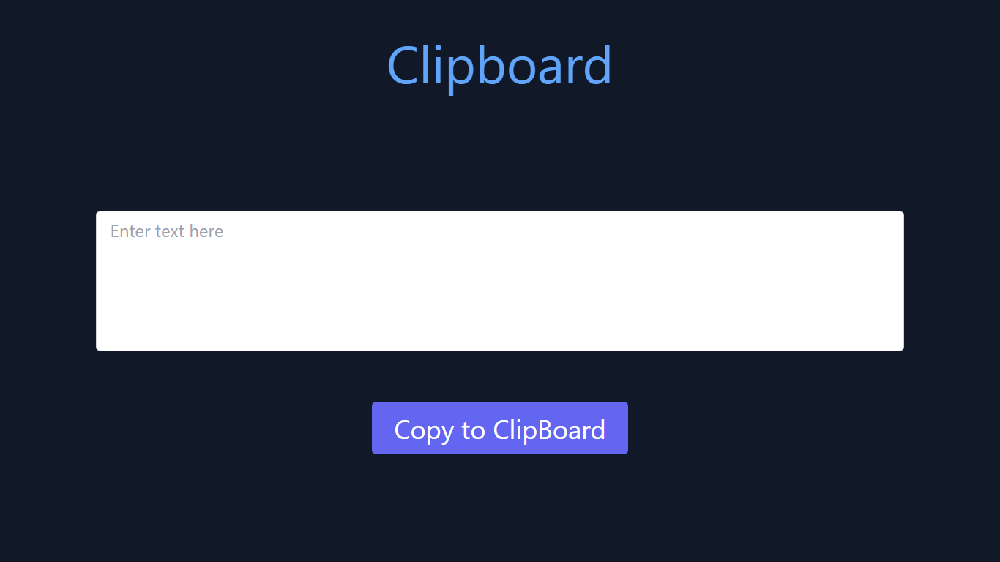

# Clipboard
by -Divesh Thakre

### Whenever a user wants to store something in the clipboard, he enters in the textbox  and on clicking on  button, it will save in the clipboard.

- 
- 
- 

key learnings:
- How to research for something you don't know.
- adding Eventlistners.
- setTimeout.
- getting text from user input.

#